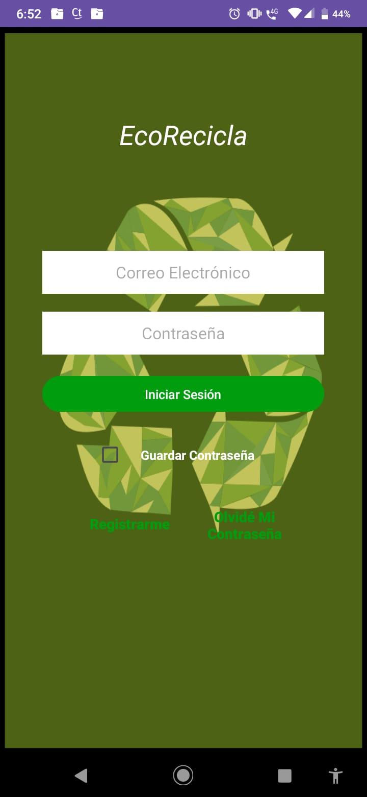
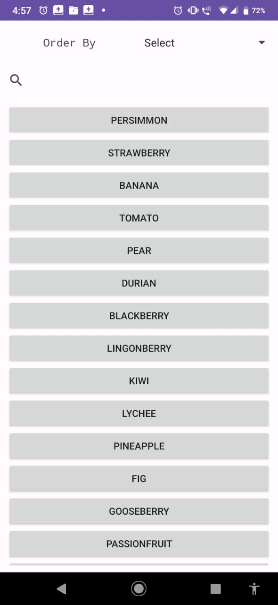
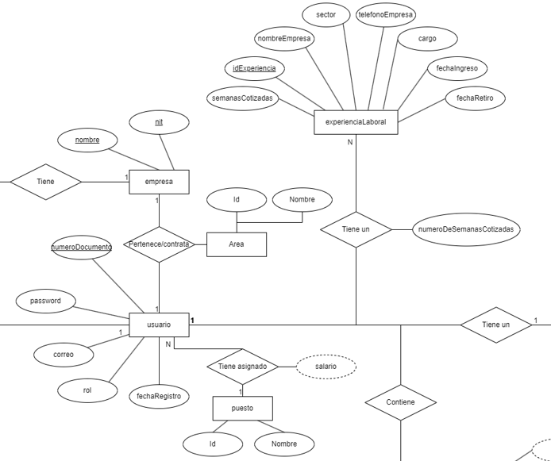
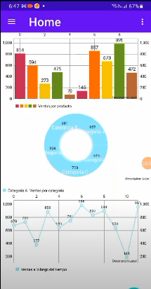

<h1 align="center">Bienvenido, Soy Jonathan Duarte 👋</h1>

  

 

<h3 align="left">Connect with me:</h3>

  📫 camiloduarteg@gmail.com
   
<h3 align="left">Languages and Tools:</h3>

                 

# PORTAFOLIO DE PROYECTOS

<table>
<tr>
</td> 
<td width="50%">
<h2 align="center">Eco Recicla</h2>

  App móvil para Bogotá que permite a los usuarios notificar la acumulación de materiales reciclables. El vehículo más cercano de una microempresa de reciclaje recibe la alerta.
   
  <b> Java y Andorid Studio </b>

                                                                                      
</td> 
                                                                             
</td> 
  
<td width="50%">
<h2 align="center">CONSUMO DE API CON RETROFIT</h2>

Se consume una api con el fin de mostrar al usuario los datos de la misma por medio de un app movil que me permite aplicar filtros para saber cual es la fruta con más calorias y asi. 
  <b>Kotlin y Andorid Studio</b>

                                                                                   
</td>  
</tr>

<tr>
<td width="50%">
<h2 align="center">BASE DE DATOS EMPLEADOS</h2>

  Base de datos para ayudar a tener el registro de los empleados de una empresa, manejando dos roles con el fin de que las opciones de empleador como empleado sea variado.
   
  <b> MySQL Workbench. </b>

 <td width="50%">
	<h2 align="center">SUBLI APP</h2>
 

	
	

	
	
	

	
Subly App es un proyecto de la materia desarrollo de software que busca ayudar a una pequeña empresa de sublimación a interactuar de mejor manera con los clientes permitiendo     hacer pedidos por medio de una aplicacion movil desarrollada en java. Para este desarrollo se usaron  metodologías Agiles, uniendo <b>SCRUM</b> y <b>RUP</b>.Se realizó un      fuerte trabajo en <b>grupo</b>  en un tiempo de 4 meses y la organización y gestión fue con ayuda de la herramienta <b>Jira</b>.(respectivo versionamiento en <b>GitHub</b>)

 

                                                                                      

</tr>   

</table>                                                                               

 

### ⚙️ &nbsp;GitHub Analytics

  
  

