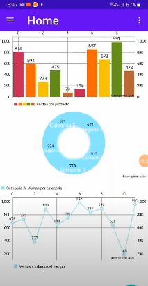

<h1 align="center">Hola,Soy Camilo Duarte 👋</h1>

  

 

<h3 align="left">Connect with me:</h3>

  📫 camiloduarteg@gmail.com
   
<h3 align="left">Languages and Tools:</h3>

                 

## Proyectos 

<table>
<tr>
<td width="50%">
<h3 align="center">Subli App</h3>

Subly App es un proyecto de la materia desarrollo de software que fue desarrollado con el uso de metodologías Agiles, uniendo SCRUM y RUP. Este proyecto se realizó en grupo y en un tiempo de 4 meses. La organización y gestión se realizó con ayuda de la herramienta JIRA.

                                                                                      
</td>       
<td width="50%">
<h3 align="center">Consumo de Api con Retrofit</h3>

Se consume una api con el fin de mostrar al usuario los datos de la misma por medio de un app movil que me permite aplicar filtros para saber cual es la fruta con más calorias y asi, realizado en Kotlin y Andorid Studio

                                                                                      
</td>  
</table>                                                                                 

 

### ⚙️ &nbsp;GitHub Analytics

  <a href="https://github.com/jonathancamiloduartegomez">
  

